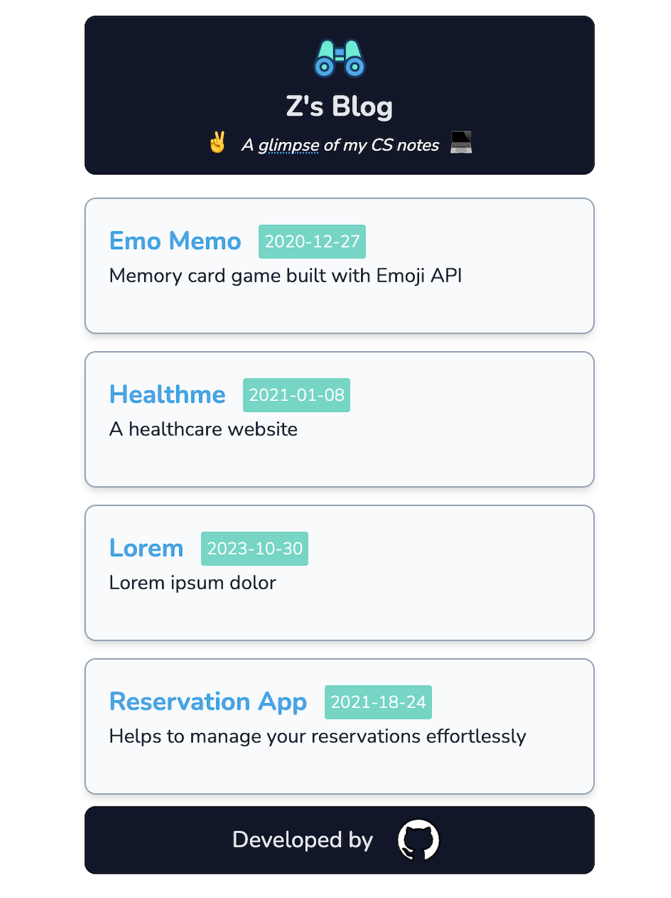

# Glimpse

### A blog developed by next.js v13

✨ I am planning to collect my CS notes on this blog page after studying, particularly from the [OSSU](https://github.com/ossu/computer-science) curriculum.

🔗 Live Demo: [glimpse](https://glimpse-aydinfz.vercel.app)

## 📝 Packages

- next
- next/font
- react-dom
- gray-matter
- markdown-to-jsx
- tailwind
